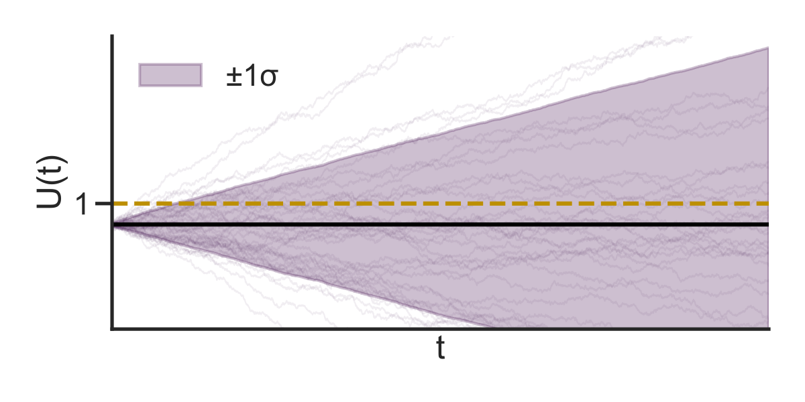
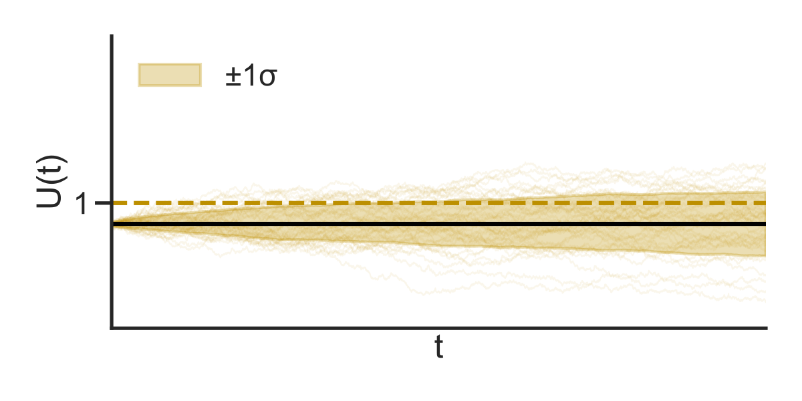
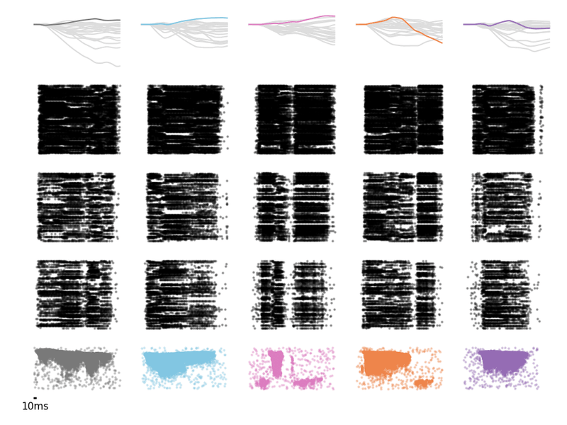
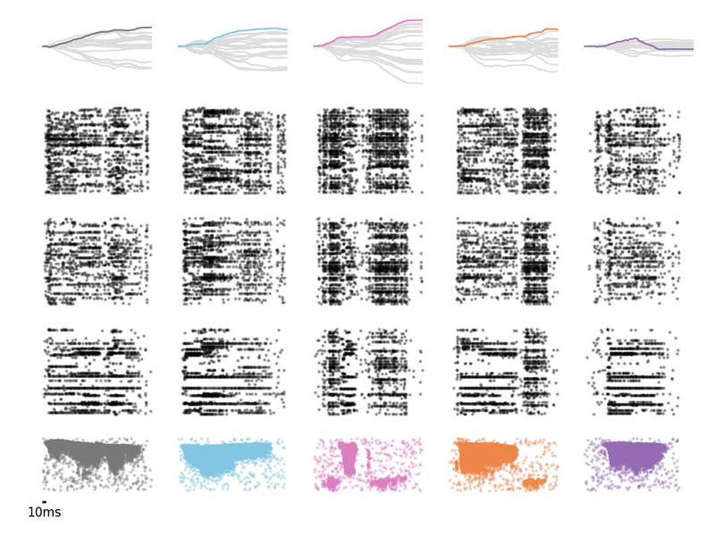

# PIF: periodic reset-and-fire neurons

PIF is a lightweight alternative to a leaky integrate-and-fire (LIF) neuron. A LIF neuron keeps leaky membrane and synaptic states. A PIF neuron keeps one non-leaky membrane and clears it at fixed times. This removes the decay operations while still preventing the membrane from growing forever.

This package provides:

- homogeneous and heterogeneous PIF groups;
- an initializer made for the PIF integration window;
- a non-leaky readout;
- EFLOP counting for connections, neurons, resets, and readouts.

## PIF dynamics

Let $u_{n,j}$ be the membrane of neuron $j$ before step $n$, $I_{n,j}$ its input, $s_{n,j}$ the spike and $r_{n,j}$ the scheduled-reset flag. The default forward update is

$$
s_{n,j}=\mathbf{1}[u_{n,j}>\theta_j],
\qquad
u_{n+1,j}=(u_{n,j}+I_{n,j})(1-s_{n,j})(1-r_{n,j}).
$$

Therefore, the neuron is reset to zero after a spike or at a scheduled reset.

To calculate the scheduled reset we convert the neuron reset period $\tau_j$ to an integer number of simulation steps $p_j$ and, to avoid simultaneous resets, we assign at every neuron $j$ an independent phase:

$$
\phi_j \sim U \\{0,\ldots,p_j-1\\}.
$$

Finally, to calculate the reset flag, we have to count the number of resets already happened $n_{r,j}$, such that:

$$
r_{n,j}=\mathbf{1}[n\ge\phi_j+(n_{r,j}+1)p_j].
$$

`PIFGroup` uses one shared value of $\tau$. `HeterogeneousPIFGroup` draws one $\tau_j$ per neuron from a Gamma distribution with mean $\tau$ and concentration $k$.

## Why PIF needs a different initializer

Stork's LIF initializer is based on an exponentially decaying response. PIF does not have that response. It sums events since its last reset, so a small imbalance in its inputs can build up instead of leaking away.

Assume $N$ independent input neurons, each firing as a Poisson process with rate $\nu$. At time $t$ after a reset, and before the PIF neuron fires, its membrane is

$$
U(t)=\sum_{i=1}^{N}w_iK_i(t),
\qquad K_i(t)\sim\mathrm{Poisson}(\nu t).
$$

For a fixed weight row,

$$
\mathbb{E}[U(t)\mid w]=\nu t\sum_i w_i,
\qquad
\mathrm{Var}(U(t)\mid w)=\nu t\sum_i w_i^2.
$$

Given a fixed weight row, this is a weighted Poisson accumulation. (Conditional on that row, it is a compound Poisson process with the empirical weights as its jump distribution.) The weights are sampled once at initialization and then stay fixed: they are not resampled at every input spike. Across random weight initializations, the process is therefore a mixture of these conditional processes. A spike or periodic reset ends the current accumulation window and starts a new one.

### Why zero mean is not enough

Suppose the weights are sampled independently with mean $\mu_w$ and variance $\sigma_w^2$. Across sampled weight rows,

$$
\mathrm{Var}(U(t))
=N\nu t(\mu_w^2+\sigma_w^2)
+N\sigma_w^2(\nu t)^2.
$$

Even when $\mu_w=0$, a finite sampled row does not usually sum to exactly zero. The non-leaky membrane accumulates this small error. Rows with a positive sum drift up, while rows with a negative sum drift down. The last term above is the variance caused by these different row sums, and it grows as $t^2$.

### Recentring the weights

With `center_weights=True`, every sampled row is shifted back to the requested
mean:

$$
w_i \leftarrow w_i-\frac{1}{N}\sum_k w_k+\mu_w.
$$

For the usual choice $\mu_u=0$, this makes $\sum_i w_i=0$ exactly for every neuron. It removes the drift and the $t^2$ term while keeping the fluctuations from the Poisson input. If the original sampled weights have variance $\sigma_w^2$, the exact centered result is

$$
\mathrm{Var}(U_{\mathrm{centered}}(t))
=\nu t(N-1)\sigma_w^2.
$$

The centered variance is linear in time, so its standard-deviation envelope grows as $\sqrt{t}$ instead of roughly linearly.

| independently sampled weights | row-recentered weights |
|:--:|:--:|
|  |  |

The thin lines are membrane trajectories and the shaded area is $\pm1$ standard deviation. The dashed line marks the firing threshold.

### Choosing the weight scale

The fluctuation-driven initializer for LIF neurons chooses the weight moments so that the stationary membrane distribution has a target mean and variance [Rossbroich et al. (2022)](#references). The PIF membrane is not stationary inside a reset window: its mean and variance change with the time $t$ since the last reset. After recentering has removed the random row drift, the initializer uses the following large-fan-in approximation:

$$
\mathbb{E}[U(t)]=N\mu_w\nu t,
\qquad
\mathrm{Var}(U(t))=N\nu t(\mu_w^2+\sigma_w^2).
$$

There is therefore no single stationary value to match. Instead, the PIF initializer matches a target mean $\mu_u$ and variance $\sigma_u^2$ on average over one reset period:

$$
\mu_u=\frac{1}{\tau}\int_0^\tau \mathbb{E}[U(t)]\,dt,
\qquad
\sigma_u^2=\frac{1}{\tau}\int_0^\tau \mathrm{Var}(U(t))\,dt.
$$

Both moments are proportional to $t$, whose average over the interval is $\tau/2$. Solving the two equations gives the parameters used by the implementation:

$$
\mu_w=\frac{2\mu_u}{N\nu\tau},
\qquad
\sigma_w^2=\frac{2\sigma_u^2}{N\nu\tau}-\mu_w^2.
$$

The formula uses $N$, while exact recentering gives the $N-1$ factor above. This small finite-fan-in correction is checked in the notebook example using the realized weight rows.

For a heterogeneous PIF layer, the initializer uses the population mean $\tau$ rather than a separate value for every neuron.

This initialization is meant to keep activity in a useful range instead of producing silent neurons or neurons that spike at every step. It is not a guarantee for every dataset or trained model, so the example notebook measures it. It plots the test-set firing rate of every hidden neuron and reports the exact number of zero-rate and always-spiking neurons.

The following snapshots are qualitative examples from the dense, unpruned 500-epoch SHD experiments. Each column is one test sample and each row is one hidden layer.

| LIF | PIF |
|:--:|:--:|
|  |  |

### 50-epoch SHD example

The example notebook contains one dense 50-epoch run for each model, using seed 42 and the same SHD split. These results describe this run; they are not confidence intervals or significance tests.

| model | test accuracy | total EFLOPs/sample | reduction vs LIF |
|:--|--:|--:|--:|
| LIF | 70.05% | 2,761,239 | baseline |
| PIF | 71.86% | 1,580,786 | 42.75% |
| heterogeneous PIF | 72.13% | 1,646,858 | 40.36% |

```python
from stork.periodic_reset import (
    NonLeakyReadoutGroup,
    PeriodicResetFluctuationDrivenInitializer,
    PIFGroup,
)

group = PIFGroup(shape=128, tau=40e-3)
readout = NonLeakyReadoutGroup(shape=20, tau_mem=0.7)
initializer = PeriodicResetFluctuationDrivenInitializer(
    nu=15.8,
    tau=40e-3,
    mu_u=0.0,
    sigma_u=1.0,
    center_weights=True,
)
```

## EFLOP counting

The counter follows the zero-skipping idea from Narduzzi et al. (2025). An operation is counted when its operands are active and nonzero. Binary spikes select weight additions, so an active nonzero connection costs one operation. The counter also includes neuron-state updates and readout updates.

For LIF layers, synaptic-state activity is not tracked separately. Membrane activity is used as a proxy for joint membrane and synaptic dynamics, and the five-operation active-state factor includes both. Under this simplified analytical convention, an active membrane costs five operations, an active membrane receiving an update costs six, an inactive membrane receiving an update costs three after direct-assignment savings, and a fully inactive neuron costs zero.

The PIF rules add the cost of a scheduled reset when the membrane was active. The non-leaky readout rules are another small extension. These two extensions are specific to this package; they are not equations copied from the paper.

The returned total is

$$
C_{\mathrm{total}}=C_{\mathrm{connections}}+C_{\mathrm{neurons}}+C_{\mathrm{readout}}.
$$

This is a hardware-independent operation count. It is not measured runtime, memory traffic, or energy. See `metrics.py` and `tests/test_periodic_reset.py` for the exact rules used by the implementation.

## Example Notebook

[`examples/06_PeriodicReset_SHD.ipynb`](../../examples/06_PeriodicReset_SHD.ipynb) compares dense LIF, PIF, and heterogeneous PIF models on SHD. It checks the initializer, trains or loads each model, plots hidden-neuron firing rates, and reports test accuracy and EFLOPs per sample.

## References

- Rossbroich, J., Gygax, J., & Zenke, F. (2022). Fluctuation-driven
  initialization for spiking neural network training. *Neuromorphic Computing
  and Engineering, 2*, 044016.
  [https://doi.org/10.1088/2634-4386/ac97bb](https://doi.org/10.1088/2634-4386/ac97bb)
- Narduzzi, S., Zenke, F., Liu, S.-C., & Dunbar, L. A. (2025). EFLOP: a
  sparsity-aware metric for evaluating computational cost in spiking and
  non-spiking neural networks. *Neuromorphic Computing and Engineering, 5*,
  034011.
  [https://doi.org/10.1088/2634-4386/addee8](https://doi.org/10.1088/2634-4386/addee8)
